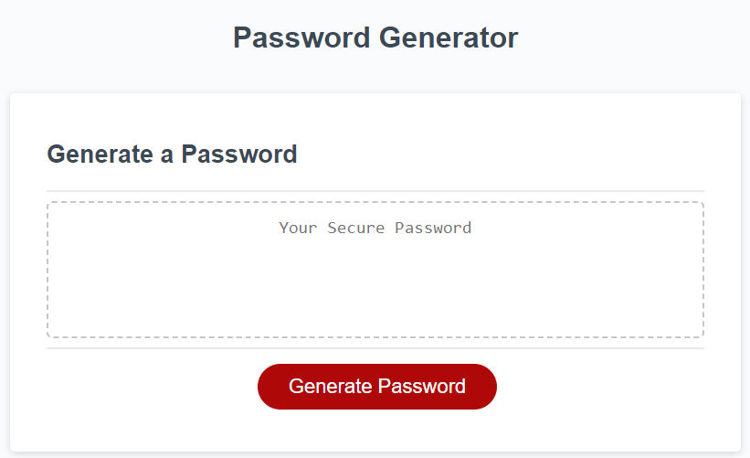
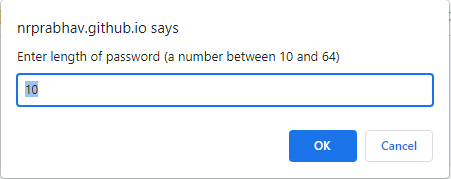
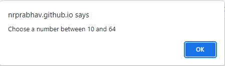
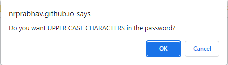
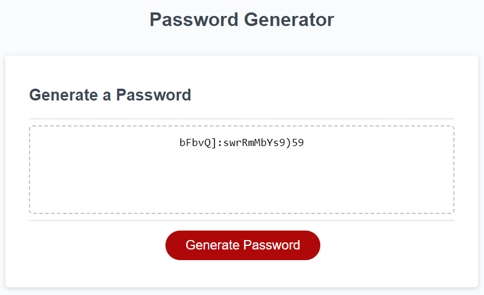

# Password-Generator

## Project Links
Deployed Link: https://nrprabhav.github.io/Password-Generator/

Repository Link: https://github.com/nrprabhav/Password-Generator

## Description
A page that generates a random string to be used as a passwork. It asks for some options and generates a password based on those options.

## Features of the Page
When the user clicks on the 'Generate Password' button the page asks for a number of inputs from the user. These include:
1. The length of the password (between 10 and 64)
2. If the length is not between these numbers an alert is given and the user is asked to enter the length again.
3. If the user wants UPPER CASE CHARATERS
4. If the user wants lower case characters
5. If the user wants numbers
6. If the user wants special characters
7. If the user does not allow even one of the characters, an alert is generated and the user is given the options again.

## Logic of the Code
### Initialize:
- array containing all upper case characters
- array containing all lower case characters
- array containing all special characters
- array containing all numbers
### Input User Options:
- input password length
- input if the user wants upper case, lower case, numbers and special characters
- store the choices in the passwordOptions array [upperCaseChoice,lowerCaseChoice,numbers,specialCharacters] with the following meaning - 0: don't use it, 1: use it
### Generate Random Password:
- Generate a random number *characterType* between 0 and 3 (0, 1, 2 or 3 corresponding to upper case, lower case, numbers and special characters, respectively)
- Check if the index in the *passwordOption* array is 0 or 1
- If 1, go on, if 0 go back and generate random number
- Generate a random number *idx* between 0 and the length of the array that has the characters (the array length is different for each type of character)
- The character at the index *idx* is the next character in the password
- repeat the steps for the length of the password

## Screenshot

### Initial page

### Prompt for password length

### Alert for wrong length

### Prompt for password options (one example)

### Password filled out
